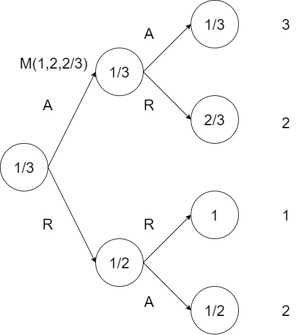

## Note:

Reader can skip straight to dynamic programming section if familiar with the problem setting and notations used. 

## Problem Setting:

There are $N$ households considering funding a shared swimming pool project that costs 1 dollar. Each household has their own valuation of how much the pool is worth, with each valuation assumed to be a random variable drawn i.i.d from $U[0,1]$. To determine whether to build the pool, each household $i$ is surveyed sequentially and offered a price $p_i$, with which they can agree or disagree. After N rounds, each household is surveyed exactly once, and if the total price agreed by the households is at least equal to the price of the pool, the pool will be built. Those that agree with their offered price can use the pool. The task is to find a pricing strategy, defined as a sequence of $p_i$ such that the expected number of households that can use the pool is maximised. 

## Notation: 

We will use the notation $<.>$ a vector. The ordering of elements in the vector matters. 

To ensure that the shared cost sums to 1, we set the asking price for the last household to be the remaining cost after the agreed cost shares of all previous surveyed household. 

For a fixed number of households in the system $N$, let $P$ be a vector that consists of the asking prices for every state in the system: 
$$ P = <p^{1}, p_{0}^{2}, p_{1}^{2}, p_{00}^{3}, p_{01}^{3}, p_{10}^3, p_{11}^3, \dots > $$
$$ P \in \mathbb{P} = [0,1]^{2^{N+1}-1}$$
Each asking price is of the form $p_{x}^{y}$ where the prefix $y$ denotes the household that is being offered, and $x \in \{0,1\}^{n}$ is the state vector recording the response of all households that have been surveyed. For instance, $p_{00}^3$ is the price offered to the third household when the first and second households have rejected their correponding offer. 

Let $V = <V_1, V_2, \dots, V_N>$ be a random vector each denoting the random variable associated with the valuation of the pool for household $i$. From the question, we have that: 

$$V_i \sim U[0,1] \quad \forall i \in \{0,1,\dots,N\}$$

Let $v = <v_1,v_2,v_3,\dots,v_N>$ be a realisation of $V$. We have that:
$$v \in \mathbb{V} = [0,1]^{N}$$

Let $A: \mathbb{V}\times\mathbb{P} \rightarrow \mathbb{N}$ be the evaluation function. For every given valuation vector $v$ and price strategy $P$, $A(v,p)$ gives the number of households that agree to contribute to the pool. The problem can therefore be phrased as follows: 

$$\max_{P \in \mathbb{P}} E_{V}(A(V,P))$$

such that: 
$$V \sim U[0,1]^N$$

## Brute force algorithm: 

The brute force algorithm involves enumerating all possible values of $P$, sampling $v$, evaluating $A(v,P)$, then $E_V(A(V,P))$ using Monte Carlo simulation. The accuracy of the solution depends on the grid size controlled by parameter $M$ and the number of Monto Carlo simulations performed $K$. The solution $P^*$ is globally optimal, but this algorithm is impractical in practice since it scales exponentially with the number of households in the system. To convience ourselves that this is true, note that the length of $P$ is $2^{N+1}-1$. A quick glance through the steps below shows that the complexity is $O(NK2^N)$.

------------------------------------------------------------------------

### BruteForceSearch

#### Input:

- N: number of households in the system
- M: number of discrete elements 
- K: number of Monte Carlo iterations
#### Output: 

- $P^*$: best policy 

#### Step:  

- Discretise interval [0,1] into set S of M elements.
- Dictionary = Map() 
- Draw all possible combinations of P - $C_p$
- Loop through each policy P in $C_p$:
    - Dictionary[P] = MontoCarloAlgorithm(P, N, K)
- $P^*$ = Dictionary.findKey(max(Dictionary[P].values))

------------------------------------------------------------------------

### MonteCarloAlgorithm

#### Input: 
- P: policy 
- N: number of households in the system
- K: number of Monte Carlo iterations

#### Output:

- E: expected number of households that can use the pool

#### Steps: 

- E = 0
- Loop K times: 
    - Draw vector v from multivarite uniform distribution(N)
    - Evaluate a = A(v,p)
    - E = E + a
    - E = E/K 
    
------------------------------------------------------------------------

### A

### Input:

- P: Policy
- v: valuations 

### Output: 

- a: number of households that can use the pool given P, v

### Steps: 

- x = array() 
- N = length(v)
- For i from 1 to N: 
    - p = P(i, x)
    - if p >= v[i]:
        - x.append(1)
    - else:
        - x.append(0)
- if x[N] = 1:
    - return a = sum(x)
- else:
    - return 0
    
------------------------------------------------------------------------

## Dynamic Programming Solution

In constructing the dynamic programming solution, we define the term $M(i,j,k)$ where $i,j,k$ represents the state information:
- There are $i$ households that agree to share cost at the current asking round.
- There are $j$ remaining households to survey. 
- The total remaining cost share to be divided among the remaining $j$ households is $k$. 

$M_P(i,j,k)$ can be understood as the backward inductive product in the decision tree induced by policy $P$. For instance, consider the serial cost sharing policy when $N=3$ (Figure 1): 

 

We can compute the value $M_p(1,2,2/3)$ recursively by considering the two scenarios when household 2 accepts or rejects the offered price of $\$1/3$: 

$$M_p(1,2,2/3) = P(V_2 > 1/3)M_p(2, 1, 1/3) + P(V_2 \leq 1/3)M_p(1, 1, 2/3)$$

That is if household 2 accepts the offered price, the number of agreeing household is increased by one, the number of household to be surveyed in the next rounds is decreased by one, and the remaining cost share is reduced by the agreed cost share. On the other hand, if the offer is rejected, the number of agreed household and the remaining cost stay the same and the number of households to be surveyed is reduced by 1. Hence we can define the Dynamic Programming recurrence relation as follows: 

$$M(i, j, k) = \max_{s\leq k}\{(1-s)M(i+1, j-1,k-s) + sM(i,j-1,k)\} $$

That is at every step, we consider the optimal price such that it the highest M value is maximised.

We also have the base case: 

$$M(i,0,0)=i$$

That is if there are no more household to be surveyed and the total agreed cost share is $1, the M value is the number of households that agree with the pricing strategy and can use the pool. Additionally, to ensure that the total agreed cost share never exceeds the cost of the pool, the price offered to the last household is the exact remaining cost, and the pool will be built if the last household agrees with the price. 

Since the search space is an interval, it is necessary to discretise the interval $[0,1]$. We now show that the DP solution is a global maxima: 

----------------------------

### Proof of global maxima

Let $P^*$ be a global maxima and $\hat{P}$ be the solution obtained from the DP algorithm. By definition: 

$$E_V(A(V,P^*)) \geq E_V(A(V, \hat{P}))$$

Consider the decision tree under policy $P^*$ and $\hat{P}$. 

We have that:
$$E_V(A(V,P^*)) = M_{P^*}(0, N, 1)=(1-p_1^*)M(1,N-1,1-p_1^*) + p_1^*M(0,N-1,1)$$
and that 
$$E_V(A(V,\hat{P})) = M_{\hat{P}}(0, N,1) = \max_{s\leq1} \{(1-s)M(1,N-1,1-s) + sM(0,N-1,1)\}$$

Hence by definition,
$$M_{\hat{P}}(0,N,1) \geq M_{P^*}(0,N,1) $$

As such, we conclude that 
$$E_V(A(V,P^*)) = E_V(A(V, \hat{P}))$$

or that the dp solution is a global maxima. 

----

### DPAlgorithm

#### Input:
- N: number of households 
- K: discretisation size 

#### Output: 
- M: dp table 
- E: maximum expected number of participating household 

#### Steps: 
- Discretise the interval [0,1] into a linear space of $K$ elements called Prices.
- Initialise $M[i,j,k]$ as an empty 3D array of size $(N+1\times N+1 \times K)$
- Set $M[i, 0, 0] = i$ for all $i$ from 0 to N
- For j from 1 to N:
    - For j from 1 to N - i: 
        - For k in Prices: 
            - M[i, j, k] = max{s <= k}(1-s)M(i+1, j-1,k-s) + sM(i,j-1,k)} 
- E = max{s <= 1} (1-s)M(1,N-1,1-s) + sM(0,N-1,1)
- return 

----

### How to acquire the pricing strategy from the DP solution

Here the optimal pricing strategy can be obtained by tracing backward the optimal price at every state. This allows us to reconstruct $\hat{P}$. For completeness, the Python implementation of the DP solution (using `numpy` package) with a tree structure of the optimal pricing strategy are included along with this report. 
